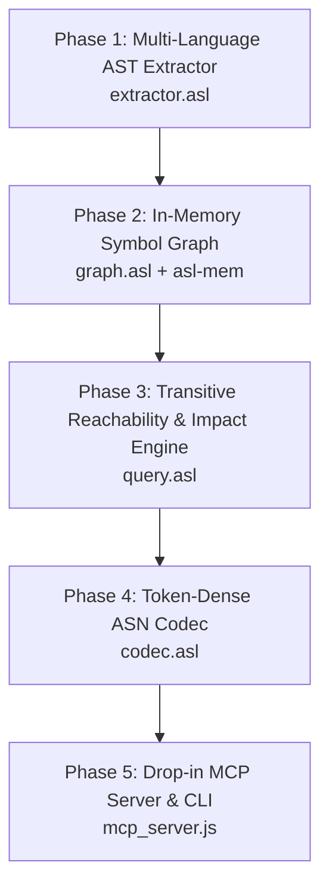

# Linked Roadmap: @genseam/asl-intel

| Phase ID | Description | Depends On | Owns | Isolation | Gate | Status |
|---|---|---|---|---|---|---|
| `intel-ast-extractor` | Multi-language symbol & ref extractor in pure ASL + Tree-Sitter bridges | `[]` | `src/extractor.asl`, `tests/extractor.test.js` | `single-tree` | `node --test tests/extractor.test.js` | `pending` |
| `intel-symbol-graph` | High-performance graph index backed by `@genseam/asl-mem` with O(1) lookups | `[intel-ast-extractor]` | `src/graph.asl`, `tests/graph.test.js` | `single-tree` | `node --test tests/graph.test.js` | `pending` |
| `intel-reachability-impact` | Query engine for callers, callees, forward impact DAG, backward affected DAG | `[intel-symbol-graph]` | `src/query.asl`, `tests/query.test.js` | `single-tree` | `node --test tests/query.test.js` | `pending` |
| `intel-dense-asn-codec` | Compact ASN frame encoder delivering >= 60% token reduction over TokenSave JSON | `[intel-reachability-impact]` | `src/codec.asl`, `benchmark/token_reduction.test.js` | `single-tree` | `node benchmark/token_reduction.test.js` | `pending` |
| `intel-mcp-server` | Universal MCP server drop-in replacing TokenSave across all AI harnesses | `[intel-dense-asn-codec]` | `bridges/mcp_server.js`, `src/intel.asl`, `tests/mcp.test.js` | `single-tree` | `node --test tests/mcp.test.js` | `pending` |
